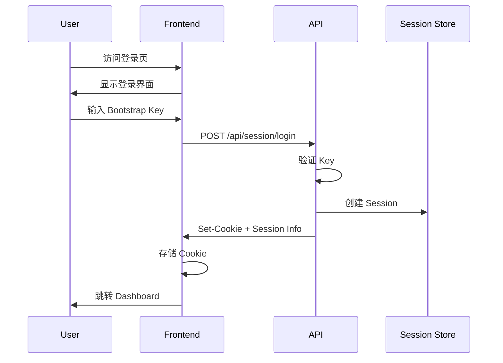
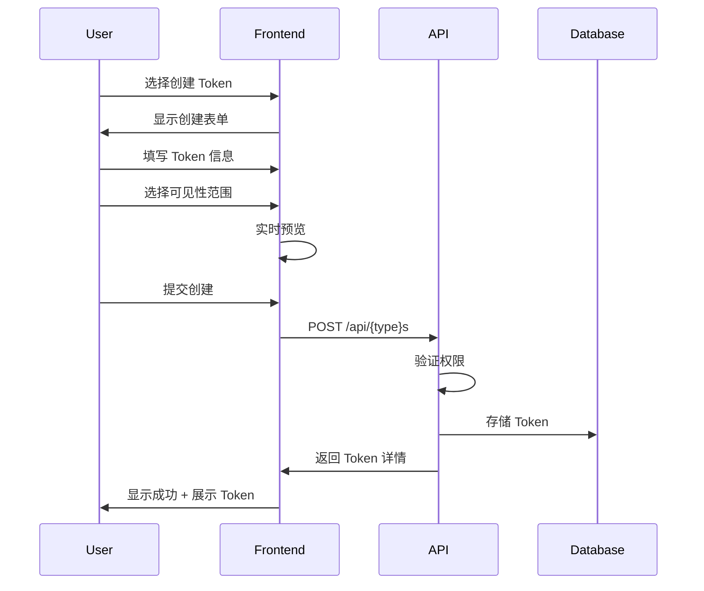
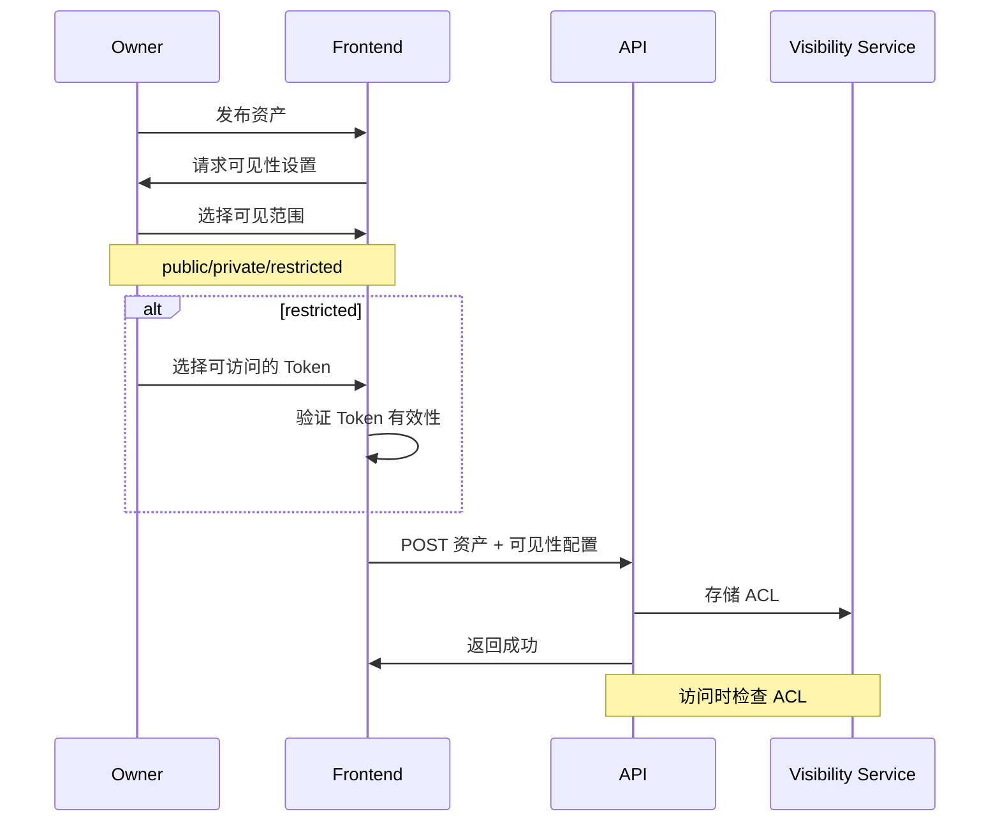
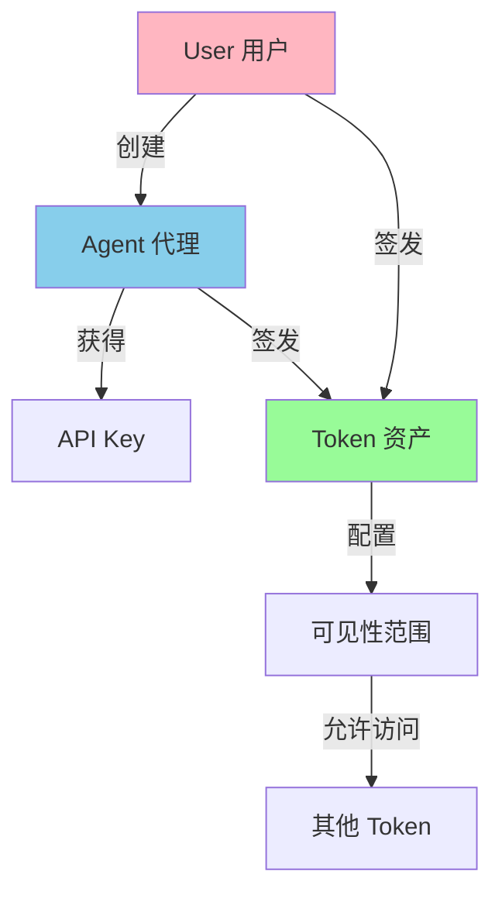

# 🎀 Agent Control Plane - 二次元风格重构方案

## 一、二次元风格分析与推荐

### 1.1 主流二次元 UI 风格对比

| 风格 | 特点 | 代表应用/游戏 | 适合度 |
|------|------|--------------|--------|
| **萌系轻量** (Kawaii) | 圆角、 pastel 色、可爱图标、柔和阴影 | 动物森友会、LINE | ⭐⭐⭐⭐⭐ |
| **科技未来** (Cyber) | 霓虹色、渐变、玻璃态、HUD 元素 | 赛博朋克2077、原神UI | ⭐⭐⭐⭐ |
| **手绘温暖** (Illustration) | 手绘质感、纸张纹理、有机形状 | 旅行青蛙、纪念碑谷 | ⭐⭐⭐ |
| **极简现代** (Minimal Anime) | 干净线条、留白、微妙动画 | 塞尔达传说、皮克敏 | ⭐⭐⭐⭐ |
| **魔法学院** (Fantasy) | 复古边框、魔法阵、书本质感 | 哈利波特游戏、原神 | ⭐⭐⭐ |

### 1.2 🏆 推荐风格：**萌系轻量科技风 (Kawaii Tech)**

**设计理念**：将控制平面的技术性与二次元可爱元素融合，打造一个既专业又有温度的「魔法特工基地」感觉。

**核心特征**：
- 🌸 **Pastel 主色调** + 活力强调色
- 🎨 **大圆角卡片** + 悬浮阴影
- ✨ **微交互动画** (弹性、摇晃、发光)
- 🎭 **可爱吉祥物** (可选 AI 助手角色)
- 🌟 **玻璃态效果** + 柔和渐变
- 💫 **粒子/光效** 背景装饰

---

## 二、设计系统 (Design System)

### 2.1 色彩系统 🎨

```typescript
// 主色板 - Pastel 梦幻系
const colors = {
  // 主色调
  primary: {
    50: '#FFF0F5',   // Lavender Blush
    100: '#FFE4E1',  // Misty Rose
    200: '#FFC0CB',  // Pink
    300: '#FFB6C1',  // Light Pink
    400: '#FF69B4',  // Hot Pink
    500: '#FF1493',  // Deep Pink (主色)
    600: '#DB7093',  // Pale Violet Red
  },
  
  // 辅助色 - 糖果色
  secondary: {
    mint: '#98FB98',     // 薄荷绿
    sky: '#87CEEB',      // 天空蓝
    lavender: '#E6E6FA', // 薰衣草紫
    peach: '#FFDAB9',    // 蜜桃色
    lemon: '#FFFACD',    // 柠檬黄
  },
  
  // 状态色
  status: {
    success: '#90EE90',  // 柔和绿
    warning: '#FFD700',  // 金色
    error: '#FF6B6B',    // 柔和红
    info: '#87CEFA',     // 浅蓝
    pending: '#DDA0DD',  // 梅花色
  },
  
  // 中性色
  neutral: {
    background: '#FFFAFA', // Snow White
    surface: '#FFFFFF',
    surfaceAlt: '#F8F8FF', // Ghost White
    border: '#E6E6FA',
    text: '#4A4A4A',
    textMuted: '#8B8B8B',
  },
  
  // 渐变预设
  gradients: {
    primary: 'linear-gradient(135deg, #FF69B4 0%, #FF1493 50%, #DB7093 100%)',
    dreamy: 'linear-gradient(135deg, #FFE4E1 0%, #E6E6FA 50%, #87CEEB 100%)',
    sunset: 'linear-gradient(135deg, #FFDAB9 0%, #FFB6C1 50%, #DDA0DD 100%)',
    aurora: 'linear-gradient(135deg, #98FB98 0%, #87CEEB 50%, #E6E6FA 100%)',
  }
};
```

### 2.2 字体系统 📝

```typescript
// 字体配置
const typography = {
  // 标题字体 - 圆润可爱
  heading: {
    // 日文/英文
    en: 'Nunito, Quicksand, sans-serif',
    // 中文 - 圆润黑体
    zh: '"PingFang SC", "Hiragino Sans GB", "Microsoft YaHei", sans-serif',
  },
  
  // 正文字体
  body: {
    en: 'Inter, system-ui, sans-serif',
    zh: '"PingFang SC", "Microsoft YaHei", sans-serif',
  },
  
  // 等宽字体 - 代码展示
  mono: 'JetBrains Mono, Fira Code, monospace',
  
  // 字号系统
  sizes: {
    xs: '0.75rem',     // 12px - 标签
    sm: '0.875rem',    // 14px - 辅助文字
    base: '1rem',      // 16px - 正文
    lg: '1.125rem',    // 18px - 小标题
    xl: '1.25rem',     // 20px
    '2xl': '1.5rem',   // 24px
    '3xl': '2rem',     // 32px
    '4xl': '2.5rem',   // 40px - 大标题
  }
};
```

### 2.3 间距与圆角 📐

```typescript
const spacing = {
  xs: '4px',
  sm: '8px',
  md: '16px',
  lg: '24px',
  xl: '32px',
  '2xl': '48px',
};

const radii = {
  sm: '8px',      // 小按钮
  md: '16px',     // 卡片
  lg: '24px',     // 大卡片
  xl: '32px',     // 面板
  full: '9999px', // 胶囊/圆形
};
```

### 2.4 阴影系统 🌟

```typescript
const shadows = {
  // 柔和阴影
  soft: '0 4px 20px rgba(255, 105, 180, 0.15)',
  medium: '0 8px 30px rgba(255, 105, 180, 0.2)',
  large: '0 12px 40px rgba(255, 105, 180, 0.25)',
  
  // 彩色发光
  glow: {
    pink: '0 0 20px rgba(255, 105, 180, 0.4)',
    blue: '0 0 20px rgba(135, 206, 235, 0.4)',
    green: '0 0 20px rgba(152, 251, 152, 0.4)',
    purple: '0 0 20px rgba(221, 160, 221, 0.4)',
  },
  
  // 悬浮效果
  hover: '0 8px 25px rgba(0, 0, 0, 0.1)',
  active: '0 4px 15px rgba(0, 0, 0, 0.08)',
};
```

### 2.5 动画系统 ✨

```typescript
const animations = {
  // 入场动画
  entrance: {
    fadeIn: 'fadeIn 0.3s ease-out',
    slideUp: 'slideUp 0.4s cubic-bezier(0.34, 1.56, 0.64, 1)',
    bounce: 'bounce 0.5s cubic-bezier(0.68, -0.55, 0.265, 1.55)',
    scale: 'scale 0.3s cubic-bezier(0.34, 1.56, 0.64, 1)',
  },
  
  // 交互动画
  interaction: {
    hover: 'hover 0.2s ease-out',
    press: 'press 0.1s ease-out',
    shake: 'shake 0.5s ease-in-out',
    pulse: 'pulse 2s ease-in-out infinite',
  },
  
  // 装饰动画
  decoration: {
    float: 'float 3s ease-in-out infinite',
    sparkle: 'sparkle 1.5s ease-in-out infinite',
    glow: 'glow 2s ease-in-out infinite',
  }
};

// CSS Keyframes
const keyframes = `
  @keyframes fadeIn {
    from { opacity: 0; }
    to { opacity: 1; }
  }
  
  @keyframes slideUp {
    from { opacity: 0; transform: translateY(20px); }
    to { opacity: 1; transform: translateY(0); }
  }
  
  @keyframes bounce {
    0%, 100% { transform: scale(1); }
    50% { transform: scale(1.05); }
  }
  
  @keyframes float {
    0%, 100% { transform: translateY(0); }
    50% { transform: translateY(-10px); }
  }
  
  @keyframes pulse {
    0%, 100% { opacity: 1; }
    50% { opacity: 0.6; }
  }
  
  @keyframes shake {
    0%, 100% { transform: translateX(0); }
    25% { transform: translateX(-5px); }
    75% { transform: translateX(5px); }
  }
  
  @keyframes sparkle {
    0%, 100% { opacity: 0; transform: scale(0); }
    50% { opacity: 1; transform: scale(1); }
  }
`;
```

---

## 三、组件设计

### 3.1 核心组件改造

#### 🎴 Card 卡片组件
```typescript
interface CardProps {
  variant?: 'default' | 'elevated' | 'glass' | 'gradient';
  color?: 'pink' | 'blue' | 'green' | 'purple' | 'yellow';
  hoverable?: boolean;
  glow?: boolean;
  children: React.ReactNode;
}

// 视觉特征：
// - 大圆角 (24px)
// - 柔和渐变边框
// - 悬浮阴影
// - hover 时轻微上浮 + 发光
```

#### 🔘 Button 按钮组件
```typescript
interface ButtonProps {
  variant?: 'primary' | 'secondary' | 'ghost' | 'gradient' | 'glow';
  size?: 'sm' | 'md' | 'lg';
  shape?: 'rounded' | 'pill' | 'circle';
  loading?: boolean;
  children: React.ReactNode;
}

// 视觉特征：
// - 胶囊形状或圆角
// - 渐变背景
// - 点击时弹性反馈
// - loading 时有旋转动画
```

#### 🏷️ Badge 标签组件
```typescript
interface BadgeProps {
  variant?: 'solid' | 'soft' | 'outline' | 'shiny';
  color?: 'pink' | 'blue' | 'green' | 'purple' | 'yellow';
  size?: 'sm' | 'md';
  children: React.ReactNode;
}

// 视觉特征：
// - 圆润外形
// - 闪亮光泽效果
// - 可选闪烁动画
```

#### 🔔 Toast 通知组件
```typescript
interface ToastProps {
  type?: 'success' | 'error' | 'warning' | 'info';
  title: string;
  message?: string;
  duration?: number;
}

// 视觉特征：
// - 从右侧滑入
// - 图标 + 渐变色
// - 自动消失进度条
// - 可爱表情图标
```

### 3.2 业务组件设计

#### 🎫 TokenCard (Token 卡片)
```typescript
interface TokenCardProps {
  id: string;
  name: string;
  type: 'apikey' | 'task' | 'secret' | 'capability';
  status: 'active' | 'expired' | 'pending';
  visibility: 'public' | 'private' | 'restricted';
  owner: {
    type: 'user' | 'agent';
    name: string;
    avatar?: string;
  };
  createdAt: Date;
  expiresAt?: Date;
  tags: string[];
  onEdit?: () => void;
  onDelete?: () => void;
  onShare?: () => void;
}
```
**设计要点**：
- 顶部彩色渐变条表示类型
- 左侧圆形头像区分 User/Agent
- 中间内容区显示名称、状态、过期时间
- 底部标签行展示可见性设置
- 右侧操作按钮组

#### 🔐 PermissionBadge (权限徽章)
```typescript
interface PermissionBadgeProps {
  permission: 'read' | 'write' | 'admin' | 'owner';
  scope: 'global' | 'asset' | 'token';
  size?: 'sm' | 'md';
}
```
**设计要点**：
- 使用不同颜色区分权限级别
- 小图标表示作用域
- hover 显示权限详情 tooltip

#### 👤 IdentitySwitcher (身份切换器)
```typescript
interface IdentitySwitcherProps {
  currentIdentity: {
    type: 'user' | 'agent';
    id: string;
    name: string;
    avatar?: string;
  };
  availableIdentities: Identity[];
  onSwitch: (identity: Identity) => void;
}
```
**设计要点**：
- 顶部悬浮胶囊按钮
- 下拉菜单展示可切换身份
- 每个身份卡片带类型图标
- 当前身份高亮显示

#### 🌈 VisibilitySelector (可见性选择器)
```typescript
interface VisibilitySelectorProps {
  value: 'public' | 'private' | 'restricted' | 'token-specific';
  tokenOptions?: Token[];
  onChange: (value: VisibilityValue) => void;
}
```
**设计要点**：
- 彩色图标按钮组
- 选中状态有发光效果
- restricted 模式显示 token 多选器

---

## 四、页面设计

### 4.1 登录页面 🚪

**布局**：
- 全屏渐变背景 (aurora 动画)
- 中央悬浮卡片
- 底部飘浮装饰粒子

**元素**：
- Logo + 吉祥物形象
- 输入框：圆角、发光边框
- 登录按钮：渐变 + 悬浮效果
- 错误提示：摇晃动画

```
┌─────────────────────────────────────┐
│  ✨ 粒子背景动画 ✨                   │
│                                     │
│       🎀 吉祥物形象                  │
│       Agent Control Plane           │
│                                     │
│    ┌─────────────────────────┐      │
│    │   🔑 输入 Bootstrap Key  │      │
│    └─────────────────────────┘      │
│                                     │
│    [🌈 渐变登录按钮]                 │
│                                     │
│    💡 提示：联系管理员获取密钥        │
│                                     │
└─────────────────────────────────────┘
```

### 4.2 Dashboard 首页 📊

**布局**：
- 顶部欢迎栏 + 快捷操作
- 统计卡片网格 (4列)
- 最近活动时间线
- 快捷入口网格

**元素**：
- 欢迎语带用户头像
- 彩色统计卡片 (Tasks/Secrets/Agents/Runs)
- 活动时间线带图标和颜色
- 快速创建按钮组

```
┌──────────────────────────────────────────────────────┐
│  👤 欢迎回来，管理员！    [+ 创建] [🔔] [⚙️]          │
├──────────────────────────────────────────────────────┤
│  ┌────────┐ ┌────────┐ ┌────────┐ ┌────────┐        │
│  │📝 Tasks│ │🔐Secret│ │🤖Agents│ │▶️ Runs │        │
│  │  128   │ │   56   │ │   12   │ │  1,234 │        │
│  └────────┘ └────────┘ └────────┘ └────────┘        │
├──────────────────────────────────────────────────────┤
│  ┌──────────────────┐  ┌──────────────────┐          │
│  │ 📈 最近活动       │  │ ⚡ 快捷入口       │          │
│  │ • 🟢 任务完成     │  │ [📝 创建任务]     │          │
│  │ • 🟡 待审批       │  │ [🔐 添加密钥]     │          │
│  │ • 🔵 Agent 上线   │  │ [🤖 注册 Agent]   │          │
│  └──────────────────┘  └──────────────────┘          │
└──────────────────────────────────────────────────────┘
```

### 4.3 Token 管理页面 🎫

**布局**：
- 顶部筛选栏 (类型/状态/可见性)
- 左侧 Token 列表
- 右侧详情面板
- 底部批量操作栏

**交互**：
- 列表项 hover 高亮
- 点击展开详情
- 拖拽排序
- 批量选择

```
┌──────────────────────────────────────────────────────┐
│  🎫 Token 管理    [全部] [API Key] [Task] [Secret]   │
├──────────────────────────────────────────────────────┤
│  🔍 搜索...     [状态 ▼] [可见性 ▼] [创建者 ▼]      │
├──────────────────────────────────────────────────────┤
│  ┌──────────────┐  ┌──────────────────────────────┐  │
│  │ 🎫 Token 列表 │  │ 📋 Token 详情               │  │
│  │              │  │                             │  │
│  │ □ 🔑 API-001 │  │ 名称: Production API Key    │  │
│  │ □ 📝 TASK-02 │  │ 类型: API Key               │  │
│  │ □ 🔐 SEC-003 │  │ 状态: ✅ Active             │  │
│  │ □ 🎯 CAP-004 │  │ 可见性: 🔒 Restricted       │  │
│  │              │  │ 创建者: 👤 Admin            │  │
│  │              │  │ 过期: 2026-12-31            │  │
│  │              │  │                             │  │
│  │              │  │ [✏️ 编辑] [🗑️ 删除] [🔗 分享]│  │
│  └──────────────┘  └──────────────────────────────┘  │
└──────────────────────────────────────────────────────┘
```

### 4.4 创建 Token 页面 ➕

**布局**：
- 步骤指示器 (3步)
- 左侧表单区
- 右侧预览区

**步骤**：
1. 选择类型 (API Key / Task / Secret / Capability)
2. 配置参数
3. 设置权限和可见性

```
┌──────────────────────────────────────────────────────┐
│  ① 选择类型  →  ② 配置参数  →  ③ 权限设置            │
├──────────────────────────────────────────────────────┤
│  ┌────────────────────────┐ ┌─────────────────────┐  │
│  │ 📋 创建新 Token        │ │ 👁️ 预览             │  │
│  │                        │ │                     │  │
│  │ 类型:                  │ │ ┌───────────────┐   │  │
│  │ [🔑] [📝] [🔐] [🎯]   │ │ │ Token 卡片    │   │  │
│  │ API   Task Secret Cap │ │ │ 实时预览      │   │  │
│  │                        │ │ └───────────────┘   │  │
│  │ 名称:                  │ │                     │  │
│  │ ┌──────────────────┐   │ │ 权限预览:           │  │
│  │ │                  │   │ │ ✅ 读取            │  │
│  │ └──────────────────┘   │ │ ✅ 写入            │  │
│  │                        │ │ ❌ 删除            │  │
│  │ 可见性:                │ │                     │  │
│  │ ○ 公开 ○ 私有 ● 受限   │ │                     │  │
│  │                        │ │                     │  │
│  │ [选择可访问的 Token ▼] │ │                     │  │
│  │                        │ │                     │  │
│  │ [🌈 创建 Token ]       │ │                     │  │
│  └────────────────────────┘ └─────────────────────┘  │
└──────────────────────────────────────────────────────┘
```

---

## 五、核心业务流程设计

### 5.1 用户认证流程 🔐



### 5.2 Token 签发流程 🎫



### 5.3 资产可见性控制流程 👁️



### 5.4 用户与 Agent 关系流程 🤖



---

## 六、权限模型设计

### 6.1 角色体系

| 角色 | 级别 | 权限范围 |
|------|------|----------|
| **Viewer** | 0 | 查看公开资产、个人资产 |
| **Operator** | 1 | + 审批请求、管理任务 |
| **Admin** | 2 | + 创建 Agent、管理密钥、系统配置 |
| **Owner** | 3 | + 删除 Agent、超级管理 |

### 6.2 资产权限矩阵

| 资产类型 | 创建者 | 同组用户 | 其他用户 | Agent |
|----------|--------|----------|----------|-------|
| API Key | 完全控制 | 只读/无 | 无 | 按配置 |
| Task | 完全控制 | 可认领 | 可见/无 | 可认领 |
| Secret | 完全控制 | 无 | 无 | 按能力绑定 |
| Capability | 完全控制 | 使用 | 无 | 调用 |

### 6.3 Token 可见性模式

```typescript
type VisibilityMode = 
  | 'public'        // 所有人可见
  | 'private'       // 仅创建者可见
  | 'restricted'    // 指定 Token 可访问
  | 'inherit';      // 继承父级权限

interface VisibilityConfig {
  mode: VisibilityMode;
  allowedTokens?: string[];  // restricted 模式下
  allowedRoles?: ManagementRole[];  // 角色限制
  expiration?: Date;  // 权限过期时间
}
```

---

## 七、数据结构

### 7.1 User (用户)

```typescript
interface User {
  id: string;
  type: 'user';
  name: string;
  email: string;
  avatar?: string;
  role: ManagementRole;
  preferences: {
    theme: 'light' | 'dark' | 'auto';
    language: 'zh' | 'en';
    notifications: boolean;
  };
  createdAt: Date;
  lastLoginAt: Date;
}
```

### 7.2 Agent (代理)

```typescript
interface Agent {
  id: string;
  type: 'agent';
  name: string;
  description?: string;
  avatar?: string;
  apiKeyHash: string;  // 脱敏存储
  riskTier: 'low' | 'medium' | 'high';
  allowedTaskTypes: string[];
  allowedCapabilityIds: string[];
  status: 'active' | 'inactive' | 'suspended';
  createdBy: string;  // User ID
  createdAt: Date;
  lastActiveAt?: Date;
}
```

### 7.3 TokenAsset (Token 资产)

```typescript
interface TokenAsset {
  id: string;
  type: 'apikey' | 'task' | 'secret' | 'capability';
  name: string;
  description?: string;
  
  // 所有权
  owner: {
    type: 'user' | 'agent';
    id: string;
    name: string;
  };
  
  // 可见性配置
  visibility: {
    mode: 'public' | 'private' | 'restricted';
    allowedTokens?: string[];  // restricted 模式下
    allowedRoles?: ManagementRole[];
  };
  
  // 权限配置
  permissions: {
    read: string[];   // 可读取的 token IDs
    write: string[];  // 可写入的 token IDs
    execute: string[]; // 可执行的 token IDs
  };
  
  // 状态
  status: 'active' | 'expired' | 'revoked' | 'pending';
  expiresAt?: Date;
  
  // 元数据
  tags: string[];
  metadata: Record<string, unknown>;
  
  // 时间戳
  createdAt: Date;
  updatedAt: Date;
}
```

### 7.4 AccessLog (访问日志)

```typescript
interface AccessLog {
  id: string;
  assetId: string;
  assetType: string;
  
  accessor: {
    type: 'user' | 'agent';
    id: string;
    name: string;
    token?: string;  // 使用的 Token
  };
  
  action: 'create' | 'read' | 'update' | 'delete' | 'execute';
  result: 'success' | 'denied' | 'error';
  
  context: {
    ip: string;
    userAgent: string;
    timestamp: Date;
  };
  
  details?: Record<string, unknown>;
}
```

---

## 八、技术实现方案

### 8.1 项目结构

```
apps/web-new/
├── app/
│   ├── (auth)/
│   │   ├── login/
│   │   └── layout.tsx
│   ├── (dashboard)/
│   │   ├── page.tsx
│   │   ├── tokens/
│   │   ├── agents/
│   │   ├── tasks/
│   │   ├── approvals/
│   │   └── layout.tsx
│   ├── layout.tsx
│   └── globals.css
├── components/
│   ├── ui/              # 基础组件
│   │   ├── button.tsx
│   │   ├── card.tsx
│   │   ├── badge.tsx
│   │   ├── input.tsx
│   │   ├── select.tsx
│   │   ├── toast.tsx
│   │   └── modal.tsx
│   ├── composite/       # 复合组件
│   │   ├── token-card.tsx
│   │   ├── identity-switcher.tsx
│   │   ├── visibility-selector.tsx
│   │   └── permission-editor.tsx
│   ├── layout/          # 布局组件
│   │   ├── sidebar.tsx
│   │   ├── header.tsx
│   │   └── footer.tsx
│   └── illustration/    # 插画组件
│       ├── mascot.tsx
│       ├── particles.tsx
│       └── decorations.tsx
├── hooks/
│   ├── use-auth.ts
│   ├── use-tokens.ts
│   ├── use-permissions.ts
│   └── use-toast.ts
├── lib/
│   ├── api.ts
│   ├── auth.ts
│   ├── permissions.ts
│   ├── utils.ts
│   └── constants.ts
├── styles/
│   ├── animations.css
│   ├── theme.ts
│   └── globals.css
├── types/
│   ├── user.ts
│   ├── agent.ts
│   ├── token.ts
│   └── index.ts
└── public/
    ├── images/
    │   ├── mascot/
    │   ├── icons/
    │   └── backgrounds/
    └── fonts/
```

### 8.2 依赖推荐

```json
{
  "dependencies": {
    "framer-motion": "^11.x",        // 动画
    "lucide-react": "^0.x",          // 图标
    "@radix-ui/react-*": "^1.x",     // 无障碍组件
    "tailwindcss": "^3.x",           // 样式
    "tailwind-merge": "^2.x",        // 类名合并
    "clsx": "^2.x",                  // 条件类名
    "zustand": "^4.x",               // 状态管理
    "react-hook-form": "^7.x",       // 表单
    "zod": "^3.x",                   // 校验
    "date-fns": "^3.x",              // 日期
    "canvas-confetti": "^1.x"        // 庆祝动画
  }
}
```

### 8.3 关键技术实现

#### 动画系统
```typescript
// components/ui/motion.tsx
export const cardHover = {
  rest: { scale: 1, y: 0 },
  hover: { 
    scale: 1.02, 
    y: -4,
    transition: { type: "spring", stiffness: 400, damping: 25 }
  },
  tap: { scale: 0.98 }
};

export const glowPulse = {
  animate: {
    boxShadow: [
      "0 0 20px rgba(255, 105, 180, 0.2)",
      "0 0 40px rgba(255, 105, 180, 0.4)",
      "0 0 20px rgba(255, 105, 180, 0.2)"
    ],
    transition: { duration: 2, repeat: Infinity }
  }
};
```

#### 主题配置
```typescript
// tailwind.config.ts
export default {
  theme: {
    extend: {
      colors: {
        primary: {
          50: '#FFF0F5',
          100: '#FFE4E1',
          200: '#FFC0CB',
          300: '#FFB6C1',
          400: '#FF69B4',
          500: '#FF1493',
        },
        kawaii: {
          mint: '#98FB98',
          sky: '#87CEEB',
          lavender: '#E6E6FA',
          peach: '#FFDAB9',
          lemon: '#FFFACD',
        }
      },
      borderRadius: {
        'kawaii': '24px',
        'pill': '9999px',
      },
      boxShadow: {
        'soft': '0 4px 20px rgba(255, 105, 180, 0.15)',
        'glow': '0 0 20px rgba(255, 105, 180, 0.4)',
      },
      animation: {
        'float': 'float 3s ease-in-out infinite',
        'sparkle': 'sparkle 1.5s ease-in-out infinite',
      }
    }
  }
};
```

---

## 九、实现路线图

### Phase 1: 基础搭建 (1-2 天)
- [ ] 创建新 Next.js 项目
- [ ] 配置 Tailwind + 设计系统
- [ ] 搭建基础布局组件
- [ ] 实现登录页面

### Phase 2: 核心组件 (3-4 天)
- [ ] 基础 UI 组件库
- [ ] Token 卡片组件
- [ ] 身份切换器
- [ ] 可见性选择器

### Phase 3: 业务页面 (4-5 天)
- [ ] Dashboard 首页
- [ ] Token 管理页面
- [ ] Token 创建流程
- [ ] Agent 管理页面

### Phase 4: 高级功能 (3-4 天)
- [ ] 权限编辑器
- [ ] 审批流程
- [ ] 动画优化
- [ ] 响应式适配

### Phase 5: 打磨上线 (2-3 天)
- [ ] 性能优化
- [ ] 无障碍支持
- [ ] 测试完善
- [ ] 部署上线

---

## 十、设计参考资源

### 灵感来源
- **原神 UI** - 精致的二次元游戏界面
- **动物森友会** - 温馨可爱的交互设计
- **Lo-fi Girl** - 柔和的视觉风格
- **Dribbble** - 搜索 "kawaii dashboard"

### 技术参考
- [Framer Motion](https://www.framer.com/motion/) - 动画库
- [Radix UI](https://www.radix-ui.com/) - 无障碍组件
- [Tailwind CSS](https://tailwindcss.com/) - 样式框架

---

*设计方案版本: v1.0*  
*创建时间: 2026-03-29*  
*风格主题: Kawaii Tech (萌系科技)*
