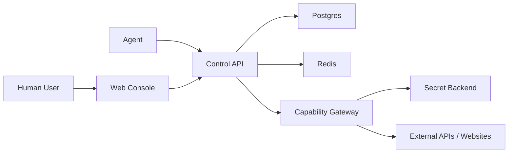

# Agent Control Plane Design

**Date:** 2026-03-16

## Historical Status

This file is retained as the earliest product-design snapshot for the repository. It should be read as historical design context, not as the current architecture source of truth.

Read these guides first for the current product framing:

- `docs/guides/agent-server-first.md`
- `docs/guides/agent-quickstart.md`
- `docs/guides/production-deployment.md`

## Overview

This project is a human-and-agent control plane for safely sharing secrets, publishing lightweight tasks, and preserving reusable execution knowledge. The platform is designed to let people enter sensitive credentials through a web console while allowing agents to consume those credentials under strict policy controls.

The central product decision is:

- Default to proxy execution so agents do not receive raw secrets.
- Allow short-lived secret leases only for workflows that cannot be proxied.
- Treat secrets, lightweight playbooks, and task runs as first-class shared resources.

## Goals

- Provide a web console where humans can create and manage secrets, capabilities, tasks, and agents.
- Let agents authenticate, discover work, claim tasks, and execute work through controlled capabilities.
- Keep raw credentials out of chat channels, task payloads, logs, and normal agent responses.
- Support lightweight reusable process knowledge that is simpler than a full skill system.
- Produce a complete audit trail for every sensitive action.

## Non-Goals

- Replacing a mature secret manager such as OpenBao, Vault, or Infisical.
- Building a full DAG workflow engine in the first release.
- Designing a universal agent protocol in v1.
- Supporting arbitrary plugin execution on day one.

## Recommended Architecture

The recommended architecture is a thin application layer on top of a mature secret backend:

- `Web Console`: Human-facing UI for secret entry, task publishing, approvals, and audit review.
- `Control API`: System-of-record for agents, capabilities, tasks, playbooks, runs, and policies.
- `Capability Gateway`: Runtime layer that performs proxy calls or issues tightly scoped temporary leases.
- `Secret Backend`: OpenBao, Vault, or Infisical for encrypted secret storage, rotation, and versioning.
- `Postgres`: Durable metadata store for references, policies, task state, and audit records.
- `Redis`: Queueing, task locks, idempotency keys, and short-lived coordination state.

## Trust Boundaries

Only two categories should be treated as highly sensitive:

- Secret plaintext
- Agent credentials

Everything else should be designed around references and policy objects.

The system should store secret plaintext only in the secret backend. The application database stores references such as `secret_ref`, policy bindings, scopes, allowed modes, metadata, and audit history. Agents should normally receive capability results, not raw credentials.

## Core Concepts

### Secret

Represents a sensitive credential such as an API token, session cookie, password, or refresh token.

Suggested metadata:

- `id`
- `backend_ref`
- `kind`
- `display_name`
- `scope`
- `rotation_state`
- `last_used_at`
- `created_by`

### Capability

Represents an approved way to use a secret. This is the main abstraction agents interact with.

Examples:

- `openai.chat.invoke`
- `qq.account.configure`
- `web.login.session_bootstrap`
- `github.repo.read`

Suggested metadata:

- `id`
- `name`
- `secret_id`
- `allowed_mode` with values such as `proxy_only`, `proxy_or_lease`
- `lease_ttl_seconds`
- `allowed_audience`
- `risk_level`
- `approval_mode`

### AgentIdentity

Represents a specific agent client or runtime.

Suggested metadata:

- `id`
- `name`
- `issuer`
- `auth_method`
- `status`
- `allowed_capability_ids`
- `allowed_task_types`
- `risk_tier`

### Task

Represents a lightweight unit of work created by a human or another agent.

Suggested metadata:

- `id`
- `title`
- `task_type`
- `input`
- `required_capability_ids`
- `lease_allowed`
- `approval_mode`
- `status`
- `priority`
- `created_by`
- `claimed_by`

### Playbook

Represents reusable lightweight execution knowledge that sits between a full skill and a short note.

Suggested contents:

- Task pattern description
- Required capability hints
- Common pitfalls
- Suggested parameter shape
- Success criteria

### Run

Represents one execution attempt of a task by an agent.

Suggested metadata:

- `id`
- `task_id`
- `agent_id`
- `status`
- `started_at`
- `completed_at`
- `capability_invocations`
- `lease_events`
- `result_summary`
- `output_payload`
- `error_summary`

## Primary Flows

### 1. Secret Onboarding

1. A human enters a secret in the web console.
2. The Control API writes the secret to the secret backend.
3. The Control API stores only a reference and metadata in Postgres.
4. The user binds the secret to one or more capabilities.
5. The user optionally defines whether a capability is proxy-only or lease-capable.

### 2. Task Creation and Claiming

1. A human creates a task in the web console.
2. The task references required capabilities instead of containing raw tokens.
3. Agents list tasks they are eligible to claim.
4. One agent claims the task and receives the task payload plus policy context.
5. Claim state is locked through Redis and persisted in Postgres.

### 3. Proxy Invocation

1. The agent calls the Control API with `task_id`, `capability_id`, and action parameters.
2. The Control API authorizes the action and forwards it to the Capability Gateway.
3. The Capability Gateway fetches the secret from the secret backend.
4. The gateway calls the external target.
5. The gateway returns a sanitized response to the agent.
6. The system writes an audit event and attaches it to the run.

### 4. Lease Issuance

1. The agent requests a temporary lease for a capability.
2. The Control API evaluates policy, task scope, approval state, TTL limits, and audience restrictions.
3. If allowed, the gateway issues a short-lived lease.
4. The lease is tagged with task, agent, purpose, and expiry.
5. Lease usage is logged and expired automatically.

## Security Model

### Authentication

- Humans authenticate to the web console through standard session-based auth.
- Agents authenticate with machine identity credentials such as signed tokens, client certificates, or backend-issued keys.
- Each agent gets its own identity. Shared global agent tokens should be avoided.

### Authorization

- Authorization should be capability-centric.
- Tasks do not grant new privileges. They can only request actions the claiming agent is already allowed to perform.
- Lease issuance must require both capability permission and task-level permission.

### Secret Handling Rules

- Secret plaintext must never be stored in Postgres, Redis, task payloads, or standard logs.
- Secret values must be redacted from UI history, traces, and error output.
- Lease mode must be opt-in per capability.
- Lease duration must be short and bounded by policy.

### Audit

Every sensitive event should create a durable audit record:

- Secret creation or update
- Capability binding changes
- Task creation and claiming
- Proxy invocation
- Lease issuance and expiration
- Approval decisions

## Failure Handling

- If the secret backend is unavailable, proxy and lease operations should fail closed.
- If Redis loses a task lock, task ownership should be revalidated against Postgres.
- If an external API call fails, the run record should capture the failure reason and retryability.
- If a lease expires during execution, the agent should receive an explicit recoverable error code.

## API Shape

The public API can start as JSON over HTTPS. MCP compatibility can be added later by exposing the same core operations through a tool server.

Suggested operations:

- `POST /api/secrets`
- `POST /api/capabilities`
- `GET /api/tasks`
- `POST /api/tasks`
- `POST /api/tasks/{id}/claim`
- `POST /api/tasks/{id}/complete`
- `POST /api/capabilities/{id}/invoke`
- `POST /api/capabilities/{id}/lease`
- `GET /api/runs`
- `POST /api/playbooks`
- `GET /api/playbooks/search`

## MVP Scope

The first release should stay narrow:

- Web pages for `Secrets`, `Capabilities`, `Tasks`, `Agents`, and `Runs`
- Agent authentication
- Task queue with claim and complete behavior
- Proxy invocation through the gateway
- Optional short-lived leases for a subset of capabilities
- Basic playbook authoring and retrieval
- Full audit logging

## Out of Scope for MVP

- Multi-step workflow orchestration
- Cross-region replication
- End-user billing
- Fine-grained tenant isolation beyond a single trusted workspace
- Broad third-party plugin marketplace

## Recommended Initial Stack

- `Next.js` for the web console
- `FastAPI` for the Control API and Capability Gateway
- `Postgres` for metadata and audit records
- `Redis` for locks and transient coordination
- `OpenBao` as the initial secret backend
- `Docker Compose` for local development

## Testing Strategy

The implementation should include four layers of verification:

- Unit tests for policy checks, lease validation, and task state transitions
- Integration tests for the secret backend adapter and gateway behavior
- API tests for task claiming, proxy invocation, and lease issuance
- End-to-end tests for key web flows such as creating a secret and publishing a task

## Iteration Roadmap

### Phase 1

- Single-workspace MVP
- OpenBao-backed secrets
- One or two capability adapters
- Human-created tasks and agent-completed runs

### Phase 2

- MCP server exposure
- Richer playbook search
- More adapters and approval policies

### Phase 3

- Multi-tenant isolation
- Agent-to-agent delegation
- Workflow chaining and scheduled tasks

## Open Questions

- Which external systems need first-class capability adapters in v1
- Whether lease payloads should ever return raw secret text or only derived session artifacts
- Whether approvals should be synchronous in the UI or async through notifications
