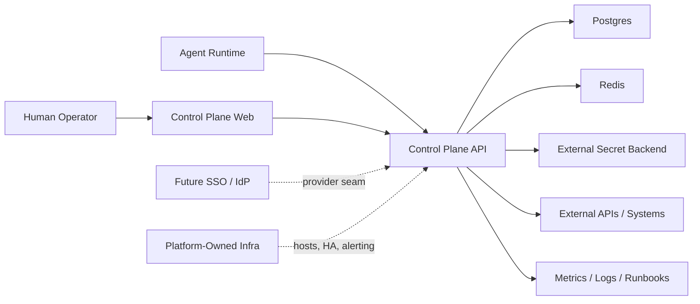

# Control Plane Architecture Design

**Date:** 2026-04-02

**Goal:** Define a stable engineering architecture for the control plane so the repository can ship a truthful trial-run baseline now while preserving clean upgrade paths to enterprise identity, managed infrastructure, and higher operational maturity later.

**Design status:** Proposed architecture baseline for all follow-on domain designs.

---

## 1. Why This Design Exists

The repository has crossed the point where ad hoc feature completion is no longer the right way to evolve it. The control plane now has real management routes, review flows, catalog behavior, operator sessions, audit events, and production-oriented runbooks. That means the next design step must stop being "what page do we add next" and become "what system are we actually building."

This document establishes that system boundary.

Its job is to answer five questions before deeper domain design starts:

- What is the product, exactly?
- What belongs inside this repository?
- What belongs to platform ownership outside this repository?
- Which domains are canonical system-of-record domains?
- Which interfaces must remain stable so later enterprise work is additive instead of disruptive?

This is intentionally an architecture document, not an implementation plan. It defines the shape of the system that later documents must refine for policy, audit, spaces, catalog, and platform handoff.

---

## 2. Product Definition

The product is an operator-supervised control plane where human operators govern machine identities, governed resources, runtime work, and agent-originated outputs from one coherent management system.

The core product stance is:

- agents act
- humans govern
- policy mediates trust
- audit preserves accountability
- platform infrastructure stays replaceable

In practical terms, the control plane is not:

- a public marketplace
- a generic workflow engine
- a secret manager replacement
- a fully self-contained enterprise platform

It is:

- the application system of record for management and runtime policy
- the governance and operator experience layer
- the integration point between agents, humans, stateful metadata, and an external secret backend

---

## 3. Architecture Principles

All later design work should preserve these principles.

### 3.1 One canonical truth per concern

Every important concern must have one home:

- identity truth lives in the identity/session domain
- governance truth lives in review/policy/audit domains
- task truth lives in task/run state
- catalog truth lives in release records, not inferred UI lists
- operator workflow truth lives on canonical management routes, not demo-only surfaces

Avoid secondary copies of the truth encoded only in frontend state, demos, or route-specific conditionals.

### 3.2 Trial-run ready inside the repo, enterprise-ready by extension

The repository must be able to ship a truthful single-host baseline for controlled trial runs.

At the same time, design choices inside the repo must assume that later production hardening will replace or extend:

- local operator auth with SSO
- single-host runtime with multi-host or managed infrastructure
- local data services with managed Postgres and Redis
- local alerting assumptions with centralized observability

The rule is simple: later enterprise work may replace infrastructure and providers, but it should not require redesigning the product model.

### 3.3 Service-layer policy, not route-scattered policy

Authorization and governance cannot remain a collection of one-off route guards. The architecture must converge toward shared policy vocabulary, shared audit vocabulary, and explicit action/resource semantics.

### 3.4 Projections are disposable, records are durable

Search views, inbox summaries, marketplace cards, dashboard counts, and cross-page highlights are projections.

They can be regenerated.

Durable records are the real source of truth:

- tasks
- agents
- human accounts
- secrets and capabilities metadata
- reviews
- catalog releases
- audit events
- sessions
- future spaces domain records

### 3.5 Human governance must remain visible

Any sensitive agent-originated action that crosses a trust boundary must be traceable through:

- who initiated it
- what resource it touched
- which policy allowed or blocked it
- whether a human approved or rejected it
- which operator session performed the governance action

If a design cannot express those facts cleanly, it is not ready.

---

## 4. Repository Boundary

The repository owns the application and the single-host baseline needed to run it truthfully in a controlled environment.

### 4.1 In scope for this repository

- control-plane web application
- control-plane API
- database schema and migrations
- runtime coordination logic
- management session handling
- policy enforcement inside the app boundary
- review, audit, event, search, catalog, and task domains
- external secret backend integration seam
- local and single-host deployment assets
- smoke checks, verification, and application-owned runbooks

### 4.2 Explicitly out of scope for this repository

- managed Postgres provisioning
- managed Redis provisioning
- external secret backend lifecycle ownership
- centralized alerting infrastructure
- enterprise SSO implementation with a real IdP
- HA networking, failover orchestration, and multi-host runtime control

### 4.3 Boundary rule

This repository ships the product.
Platform ownership ships the surrounding production environment.

That means the repository may define contracts for those external dependencies, but it must not pretend to fully own them.

---

## 5. System Context

The architecture is a layered application with clean seams to replaceable infrastructure.

### 5.1 Web application

The web application is the canonical operator surface. It is not a mock shell around demo pages. It should remain the place where operators inspect, decide, and manage.

### 5.2 API

The API is the application system of record and the only trusted write path for management and runtime state. Frontend behavior must not define domain truth independently from API contracts.

### 5.3 Postgres

Postgres is the durable metadata store for app-owned records, including identities, sessions, tasks, reviews, releases, audit events, and future spaces records.

### 5.4 Redis

Redis is coordination state, not primary business truth. It is for locking, idempotency, short-lived coordination, and failure-fast runtime behavior.

### 5.5 External secret backend

Secret plaintext belongs outside the app database. The repository owns the integration contract and fail-closed behavior, not the lifecycle ownership of the backing secret system.

---

## 6. Canonical Domains

This section defines which domains the architecture considers first-class and what each one owns.

### 6.1 Identity and session domain

Owns:

- human management accounts
- operator sessions
- agent identities
- agent tokens
- role and actor shape
- future operator identity provider seam

Does not own:

- business policy decisions about which role may perform which action

Why it exists:
identity establishes who is acting, but not yet whether the action is allowed.

### 6.2 Policy and governance domain

Owns:

- action authorization vocabulary
- role-to-action mapping
- review requirements
- management permissions
- runtime access enforcement inputs

Does not own:

- session issuance
- raw resource persistence

Why it exists:
policy must be expressed once and reused across routes, services, and audit.

### 6.3 Audit domain

Owns:

- durable action history
- actor/subject/action/result recording
- governance decision recording
- operator-session correlation
- request correlation hooks

Does not own:

- business workflows themselves

Why it exists:
the system needs accountability that survives UI changes and projection changes.

### 6.4 Resource domain

Owns:

- governed resource metadata for secrets and capabilities
- publication status
- creation provenance
- lifecycle state inside the app boundary

Does not own:

- secret plaintext storage

Why it exists:
the application must reason about governed resources even though secret material lives elsewhere.

### 6.5 Task and runtime domain

Owns:

- tasks
- claims
- completion state
- runtime invocation context
- lease and proxy-related governance hooks

Does not own:

- operator identity
- catalog projection behavior

Why it exists:
runtime operations must stay explicit and auditable as their own lifecycle.

### 6.6 Review domain

Owns:

- human review queue
- approve/reject decisions
- review status transitions
- review provenance

Does not own:

- downstream release modeling

Why it exists:
human governance decisions are distinct from catalog publishing or frontend display state.

### 6.7 Catalog domain

Owns:

- operator-facing published release records
- release versioning
- release metadata
- release history

Does not own:

- raw review decision logic
- public storefront behavior

Why it exists:
published catalog state must be durable and versioned, not reconstructed from ad hoc UI filters.

### 6.8 Event and search domain

Owns:

- inbox events
- focused entry links
- search documents/results
- operator navigation projections

Does not own:

- underlying business truth

Why it exists:
events and search are discovery surfaces built on top of canonical domains, not replacements for them.

### 6.9 Spaces domain

Target ownership:

- operational workspace/container records
- space membership
- space timeline entries
- context binding between agents, events, reviews, and tasks

Current state:
the route exists, but the domain is not yet fully realized.

Architecture requirement:
spaces must evolve into a persisted domain, not remain a dashboard composed from unrelated lists.

---

## 7. Domain Relationships And Source-of-Truth Rules

To avoid later architectural drift, these relationships should be treated as hard rules.

### 7.1 Review to catalog

- review decides whether an agent-originated submission may become active
- catalog release records represent publishable released state
- the marketplace UI reads catalog truth for published items
- the review queue remains the truth for pending and rejected governance items

This prevents the marketplace from inventing a second approval path.

### 7.2 Identity to audit

- every sensitive human governance action must reference a human identity
- every human identity action should be attributable to a concrete operator session
- future SSO changes may change how identities authenticate, but not how audit references them

### 7.3 Tasks to events

- task lifecycle changes may emit events
- events are notifications and focused entry points, not substitutes for task state

### 7.4 Resources to runtime

- tasks and agents may reference capabilities
- runtime enforcement checks policy against the canonical resource and identity records
- runtime projections must fail closed when required coordination or upstream trust data is unavailable

### 7.5 Spaces to other domains

- spaces aggregate and contextualize
- spaces do not become a hidden second source of truth for reviews, tasks, or identities

---

## 8. Trust Boundaries And Data Classification

The architecture should explicitly classify data instead of treating everything alike.

### 8.1 Sensitive data

- secret plaintext
- external secret backend tokens
- bootstrap credentials
- session secrets
- issued runtime credentials

Handling rule:
do not persist this data in general-purpose domain tables, UI state, or ordinary logs.

### 8.2 Controlled operational data

- audit events
- review decisions
- session records
- token metadata
- risk posture
- governance reasons

Handling rule:
store durably, expose intentionally, and treat mutation as a governed action.

### 8.3 Standard business metadata

- task titles
- summaries
- display names
- catalog notes
- event summaries

Handling rule:
these may be indexed and projected, but they still require provenance and sensible redaction boundaries.

---

## 9. Control Surfaces

The product should distinguish canonical operator surfaces from sandbox surfaces.

### 9.1 Canonical operator surfaces

These routes are the real management product:

- `/`
- `/inbox`
- `/identities`
- `/spaces`
- `/marketplace`
- `/reviews`
- `/tokens`
- `/tasks`
- `/assets`
- `/settings`

All serious workflow completion should terminate on these surfaces.

### 9.2 Demo surfaces

`/demo` and equivalent demo routes are comparison and sandbox surfaces only.

They may help explain or validate behavior, but they must not become the authoritative operator experience.

### 9.3 Focused entry model

Canonical pages should accept contextual entry state through stable query contracts rather than spawning separate detail-route hierarchies too early.

This preserves:

- one navigation grammar
- one source of workflow truth
- fewer duplicated pages
- cleaner audit and operator training paths

---

## 10. Deployment Topology Model

The architecture distinguishes three levels of maturity.

### 10.1 Development

- local SQLite or local DB
- local Redis when needed
- optional memory secret backend for local-only work
- demo seed paths allowed

### 10.2 Trial-run baseline

- single-host docker compose
- production-like Postgres and Redis
- external secret backend
- Caddy ingress
- smoke checks, metrics, backup and restore runbooks

This is the highest maturity level the repository itself must fully guarantee.

### 10.3 Enterprise platformized deployment

- managed or replicated Postgres
- managed or replicated Redis
- platform-owned secret backend lifecycle
- SSO or enterprise IdP
- centralized logs, alerts, dashboards, and escalation
- multi-host or orchestrated runtime

This is intentionally outside repository ownership, but the repository must remain compatible with it.

---

## 11. Engineering Requirements

This architecture is only useful if it constrains implementation quality.

### 11.1 Contract requirements

Every important domain should have:

- explicit API contracts
- explicit persistence model
- explicit lifecycle/status model
- explicit permission model
- explicit audit expectations

### 11.2 Migration requirements

Schema changes must:

- be additive by default
- carry a clear rollback posture
- avoid hidden cross-domain coupling
- keep the repository verification command truthful

### 11.3 Testing requirements

Each new domain or architectural change should include:

- domain-level tests
- route contract tests
- policy tests where actions are role-sensitive
- audit tests where actions are trust-sensitive
- focused UI tests where management flows depend on cross-surface consistency

### 11.4 Observability requirements

The app boundary must emit enough signals to operate a supervised trial run:

- health
- metrics
- request correlation
- governance counters
- session lifecycle indicators
- failure-fast behavior for critical dependencies

---

## 12. Target Evolution Path

This is the recommended design order from here.

### Phase A: Architecture closure

Produce design documents that refine this baseline for:

- operator identity and policy model
- audit and governance event schema
- spaces domain
- catalog and marketplace domain
- platform handoff package

### Phase B: App-bound hardening

Implement what the repo should fully own:

- explicit operator action matrix
- unified audit semantics
- persisted spaces v1
- stronger catalog lifecycle semantics
- systematic accessibility and management-flow consistency

### Phase C: Platform handoff readiness

Prepare the clean boundary for:

- real SSO integration
- managed stateful services
- HA runtime
- centralized alerting and incident ownership

The app should be structurally ready for those steps before the platform team begins them.

---

## 13. Decisions Locked By This Document

The following decisions should now be treated as architectural defaults unless a later ADR explicitly changes them.

- The control plane is an operator-supervised application, not a public product marketplace.
- The repository owns a truthful trial-run baseline, not full enterprise infrastructure.
- External infrastructure should be replaceable through seams, not embedded into domain models.
- Canonical operator routes remain the primary workflow surfaces.
- Review truth and catalog truth are distinct but connected.
- Spaces must become a persisted domain and may not remain a permanent dashboard-only concept.
- Authorization, governance, and audit must converge on shared service-layer vocabulary.

---

## 14. Open Follow-On Design Topics

This document intentionally does not finalize the details of:

- exact operator action matrix
- exact audit event schema
- exact spaces entity model
- exact catalog release lifecycle
- exact platform handoff checklist

Those need their own design documents, but they must all conform to this architecture baseline.

---

## 15. Exit Criteria For Accepting This Architecture

This architecture should be considered accepted when the team agrees that:

- the repository/platform boundary is clear
- the canonical domains are clear
- the source-of-truth rules are clear
- the trial-run versus enterprise distinction is clear
- later domain design can proceed without re-litigating the system shape

If those five things are not true, the architecture is still incomplete.
